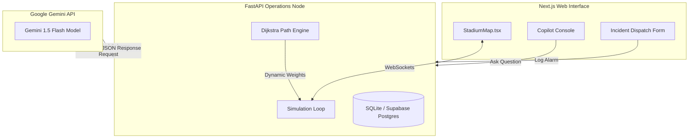

# Guardian AI - AI-Powered Stadium Intelligence Platform

Guardian AI is a production-grade Command & Control Operations Center designed for the **FIFA World Cup 2026**. 

The platform leverages simulated real-time telemetry (crowd heatmaps, occupant counts, security/medical team positions) and combines it with **Dijkstra-based routing** and the **Google Gemini API** (Structured JSON output schemas) to predict safety hazards, coordinate evacuation plans, and advise command centers in real-time.

---

## 🌟 Primary Features

1. **Live Heatmap Telemetry**: Interactive vector-rendered stadium map overlaying occupant density layers, active emergency sirens, and dispatched security/medical units.
2. **AI Crowd Prediction**: 5m, 10m, 20m, 30m hazard assessments explaining *why* bottlenecks form and outlining preventative actions.
3. **AI Tactical Action Plans**: Manual or automated incident logs trigger Gemini to instantly structure step-by-step containment plans.
4. **Smart Route Engine**: Calculations that automatically adjust pathing weights around dense spectator blockages and active fire/stampede hazards.
5. **Operations Copilot**: Natural language console with pre-configured suggestion logs answering complex queries (e.g. "What happens if Gate B closes?").
6. **Executive Situation Report**: Printable command summaries with one-click download buttons.

---

## ⚙️ Setup & Execution

Run the orchestrator script to automatically create virtual environments, install packages, and boot both servers:

```bash
./run.sh
```

### Server Links
- **Command Console**: [http://localhost:3000](http://localhost:3000)
- **FastAPI Core Swagger docs**: [http://localhost:8000/docs](http://localhost:8000/docs)
- **Live updates WebSocket**: `ws://localhost:8000/api/ws`

---

## 🗺️ System Architecture



---

## 📂 Folder Structure

```
untitled folder/
├── frontend/                 # Next.js App Router Client
│   ├── src/
│   │   ├── app/              # Dashboard pages
│   │   ├── components/       # Custom interactive SVG maps & layout shells
│   │   ├── hooks/            # useWebSocket connection manager
│   │   ├── services/         # api.ts HTTP client endpoints
│   │   └── types/            # TypeScript interfaces
├── backend/                  # FastAPI Application Server
│   ├── app/
│   │   ├── api/              # HTTP routers & WebSockets
│   │   ├── core/             # database config & credential checkers
│   │   ├── models/           # SQLAlchemy models
│   │   ├── schemas/          # Pydantic schemas
│   │   └── services/         # Gemini API, Route planner, Simulator loops
│   └── requirements.txt      # Python package registry
├── .env                      # Global credential keys file
└── run.sh                    # Startup wrapper
```

---

## 🎤 5-Minute Demo Script

1. **Slide / Hero Entry**: Open `http://localhost:3000`. Show the spinning glowing globe representing FIFA World Cup venues. Explain the goal: moving stadium operations from *reactive* to *predictive*.
2. **Open Dashboard**: Click "Enter Command Console". Point to the interactive heatmap updating every 3 seconds. Point to the "AI Situation Report" summary.
3. **Interact with Copilot**: Navigate to the "AI Copilot" tab. Click the suggested query `"Predict next congestion."` showing how Gemini forecasts bottlenecks.
4. **Trigger Emergency & Evacuation**:
   - Go to "Emergency Room". Click `"Report New Incident"`.
   - Log a `"fire"` in `"Zone A"` (Severity: `"critical"`).
   - Show the **AI Tactical Action Plan** instantly detailing step-by-step dispatch guidelines.
   - Under routing, select start as `"Gate A"`, check `"Rescue Tunnel"`, and click `"Calculate Safe Transit"`.
   - The route is calculated, bypassing Zone A. Return to the "Live Command" tab to see the glowing, animated dotted route line overlaying the map!
5. **Resolve**: Click `"Resolve Incident"` in the Emergency Room. The route disappears, restoring the stadium grid to nominal parameters.
